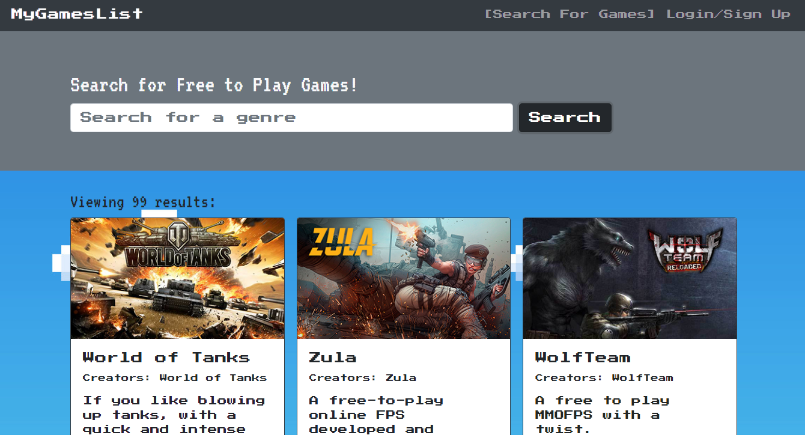

# MyGamesList

  

  ***
  ## Table of Contents
  - [Description](#description)
  - [Visual Presentation](#visual-presentation)
  - [Technologies Used](#technologies-used)
  - [Installation](#installation)
  - [Usage](#usage)
  - [Contribution](#contribution)
  - [Testing](#testing)
  - [Additional Info](#additional-info)

  ***
  ## Description
  Ever wanted to know what free games were available in a specific genre? MyGamesList allows you to search though games by genre and save them to you user profile! Search through hundreds of different tiltes and descover whats availble to play

  ***
  ## Technologies Used
  

  ***
  ## Visual Presentation
  

  ***
  ## Installation
  None

  ***
  ## Usage
  Searching for free-to-play games

  ***
  ## Contribution
  No contributions are being accepted at this time.

  ***
  ## Testing
  N/a

  ***
  ## Additional Info
  - Github: 
      - Korey Luu(https://github.com/Ahrionic)
      - Nathan Marcellous(https://github.com/TabuHana)
      - Kien(https://github.com/NGGKI)
      - Christopher Vazquez(https://github.com/ChrisVazquez6)
